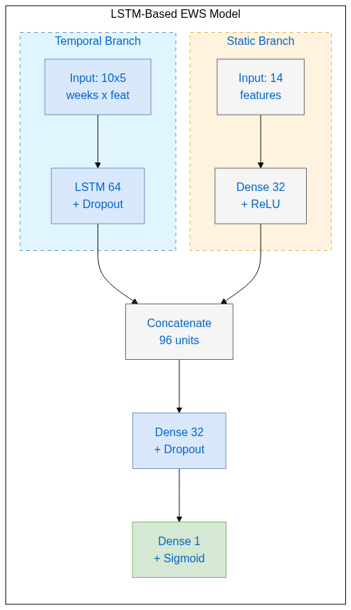

---
format:
  typst:
    toc: false
    number-sections: true
    colorlinks: true
    echo: false
  html:
    title: Bias-Aware Early Warning System for Higher Education
    subtitle: Final Summary Report
    date: '2026-01-02'
    date-format: long
    author: 
      - name: John Baker
        email: jbaker1@upenn.edu
        affiliation:
          - name: 'University of Pennsylvania Graduate School of Education'
    theme: cosmo
    toc: true
    code-copy: true
    code-fold: true
    code-overflow: wrap
    page-layout: full
format-links:
  - html
  - format: typst
    text: PDF
    icon: file-pdf
---
```{=typst}
#page(
  align(center + horizon)[
    #text(2em, weight: "bold")[Bias-Aware Early Warning System \ for Higher Education]
    #v(1em)
    #text(1.5em, style: "italic")[Final Summary Report]
    #v(3em)
    #text(1.2em)[John Baker] \
    #v(0.5em)
    #text(1em, fill: luma(100))[University of Pennsylvania Graduate School of Education] \
    #text(1em, fill: luma(100))[jbaker1\@upenn.edu]
    #v(3em)
    #text(1.1em)[January 2, 2026]
  ]
)
#pagebreak()
#outline(
  title: [Table of Contents],
  indent: auto
)
#pagebreak()
```
## Executive Summary {.unnumbered}

This research project developed and evaluated a **bias-aware Early Warning System (EWS)** to identify at-risk students in higher education while addressing algorithmic fairness concerns. Using the Open University Learning Analytics Dataset (OULAD), we built an LSTM-based temporal prediction model and systematically audited and mitigated algorithmic bias.

### Key Results {.unnumbered}

| Objective | Target | Achieved |
|-----------|--------|----------|
| Predictive Performance | AUC > 0.80 | **0.889** |
| Early Prediction | First 25% of course | **10 weeks** (~26% of 33–38 week courses) |
| Bias Mitigation | Reduce disparities | **All four attributes improved** |
| Intersectional Fairness | No critical issues | **Validated across 16 subgroups** |

### What We Did {.unnumbered}

1. **Built an early prediction model** using a dual-branch LSTM architecture that combines 10 weeks of VLE engagement patterns with static demographic features, enabling intervention while 75% of the course remains

2. **Audited fairness** across five protected attributes using four metrics (SPD, EOD, Equalized Odds, ABROCA), finding significant disparities for region (4/4 violations), IMD band, disability, and age

3. **Mitigated bias** using attribute-appropriate techniques: threshold optimization for large groups (region, IMD, age) and reweighting for underrepresented groups (disability), reducing Equal Opportunity Difference to near-zero while maintaining AUC

4. **Validated intersectional fairness** across 16 demographic subgroups, confirming no severe compounding disparities and AUC > 0.80 for all intersections

### Key Findings {.unnumbered}

- **Regional bias was most severe:** Students in Scotland, Wales, and London were flagged at higher rates than equally at-risk students in Ireland and Southern England
- **Mitigation approach matters:** Post-processing (threshold optimization) works for well-represented groups; pre-processing (reweighting) is needed for minorities like students with disabilities (9% of data)
- **Selection rate disparities reflect real risk differences:** The 0.266 range in intersectional selection rates mirror the underlying at-risk rate variation, not model discrimination



### Limitations Acknowledged {.unnumbered}

This analysis is bounded by OULAD's specific context (UK distance learning, 2013–2014 data), the 10-week prediction window trade-off, and unmeasured factors (employment, health, family circumstances) that influence student outcomes. The model should supplement—not replace—human judgment in student support decisions.

```{python}
#| label: setup

import os
import warnings
import numpy as np
import pandas as pd
import json
from pathlib import Path
import matplotlib.pyplot as plt
import seaborn as sns

os.environ['TF_CPP_MIN_LOG_LEVEL'] = '2'
warnings.filterwarnings('ignore')

plt.style.use('seaborn-v0_8-whitegrid')
plt.rcParams['figure.figsize'] = (12, 6)
plt.rcParams['font.size'] = 11

DATA_DIR = Path("../data/processed")
FIGURES_DIR = Path("../figures")
FIGURES_DIR.mkdir(exist_ok=True)
REPORTS_DIR = Path(".")
REPORTS_DIR.mkdir(exist_ok=True)

# Load all results
with open(DATA_DIR / 'fairness_results.json', 'r') as f:
    fairness_results = json.load(f)

with open(DATA_DIR / 'mitigation_results_region.json', 'r') as f:
    mitigation_region = json.load(f)

with open(DATA_DIR / 'mitigation_results_imd.json', 'r') as f:
    mitigation_imd = json.load(f)

with open(DATA_DIR / 'mitigation_results_disability.json', 'r') as f:
    mitigation_disability = json.load(f)

with open(DATA_DIR / 'mitigation_results_age.json', 'r') as f:
    mitigation_age = json.load(f)

with open(DATA_DIR / 'intersectional_results.json', 'r') as f:
    intersectional_results = json.load(f)

predictions = pd.read_csv(DATA_DIR / 'predictions_baseline.csv')
static_df = pd.read_csv(DATA_DIR / 'features_static.csv')
```



## Research Questions

This project addressed the following research questions:

1. **RQ1:** How do socioeconomic, geographic, and demographic characteristics predict at-risk students in higher education?

2. **RQ2:** What is the extent of algorithmic bias across protected attributes (gender, region, relative poverty, age, disability) in temporal EWS models?

3. **RQ3:** What is the effectiveness of different bias mitigation approaches (pre-processing, post-processing) in reducing prediction disparities while maintaining strong predictive performance (AUC ROC > 0.80)?

## Dataset Overview

The **[Open University Learning Analytics Dataset (OULAD)](https://analyse.kmi.open.ac.uk/open-dataset){.external target="_blank"}** contains data from `{python} f"{len(static_df):,}"` student enrollments across `{python} f"{(static_df['code_module'] + '_' + static_df['code_presentation']).nunique()}"` course presentations.

```{python}
#| label: dataset-overview
#| output: asis

from IPython.display import display, Markdown

# 1. Calculate values
total_students = len(static_df)
unique_courses = static_df['code_module'].nunique()
presentations = (static_df['code_module'] + '_' + static_df['code_presentation']).nunique()

at_risk = static_df['at_risk'].sum()
at_risk_pct = static_df['at_risk'].mean() * 100
not_at_risk = (1 - static_df['at_risk']).sum()
not_at_risk_pct = (1 - static_df['at_risk'].mean()) * 100

# 2. Build the string with explicit newlines
report_text = f"""
**Dataset Statistics:**

* **Total student enrollments:** {total_students:,}
* **Unique courses:** {unique_courses}
* **Course presentations:** {presentations}

**Target Variable (At-Risk):**

* **At-risk (1):** {at_risk:,} ({at_risk_pct:.1f}%)
* **Not at-risk (0):** {not_at_risk:,} ({not_at_risk_pct:.1f}%)

**Protected Attributes:**

""" 
# ^ Note the extra newlines above to separate the header from the list

# 3. Loop to add bullet points
for attr in ['gender', 'region', 'imd_band_imputed', 'age_band', 'disability']:
    if attr in static_df.columns:
        count = static_df[attr].nunique()
        clean_name = attr.replace('_', ' ').title().replace('Imd', 'IMD')
        # Add the bullet point with a newline at the end
        report_text += f"* **{clean_name}:** {count} groups\n"

display(Markdown(report_text))
```

```{python}
#| label: fig-atrisk-by-attribute
#| fig-cap: "At-risk rates across protected attributes"

fig, axes = plt.subplots(2, 3, figsize=(15, 10))

# Gender
ax = axes[0, 0]
gender_rates = static_df.groupby('gender')['at_risk'].mean().sort_values(ascending=False)
bars = ax.bar(gender_rates.index, gender_rates.values, color=['steelblue', 'coral'])
ax.set_ylabel('At-Risk Rate')
ax.set_title('At-Risk Rate by Gender')
ax.set_ylim(0, 0.7)
for bar in bars:
    ax.text(bar.get_x() + bar.get_width()/2, bar.get_height() + 0.01,
            f'{bar.get_height():.1%}', ha='center', fontsize=10)

# Age
ax = axes[0, 1]
age_rates = static_df.groupby('age_band')['at_risk'].mean().sort_values(ascending=False)
bars = ax.bar(age_rates.index, age_rates.values, color='steelblue')
ax.set_ylabel('At-Risk Rate')
ax.set_title('At-Risk Rate by Age Band')
ax.set_ylim(0, 0.7)

# Disability
ax = axes[0, 2]
disability_rates = static_df.groupby('disability')['at_risk'].mean().sort_values(ascending=False)
disability_rates.index = ['Has Disability' if x == 'Y' else 'No Disability' for x in disability_rates.index]
bars = ax.bar(disability_rates.index, disability_rates.values, color=['coral', 'steelblue'])
ax.set_ylabel('At-Risk Rate')
ax.set_title('At-Risk Rate by Disability Status')
ax.set_ylim(0, 0.7)
for bar in bars:
    ax.text(bar.get_x() + bar.get_width()/2, bar.get_height() + 0.01,
            f'{bar.get_height():.1%}', ha='center', fontsize=10)

# Region
ax = axes[1, 0]
region_rates = static_df.groupby('region')['at_risk'].mean().sort_values(ascending=False)
colors = ['coral' if r >= 0.5 else 'steelblue' for r in region_rates.values]
bars = ax.barh(region_rates.index, region_rates.values, color=colors)
ax.set_xlabel('At-Risk Rate')
ax.set_title('At-Risk Rate by Region')
ax.axvline(x=0.5, color='red', linestyle='--', alpha=0.5)

# IMD Band
ax = axes[1, 1]
imd_order = ['0-10%', '10-20', '20-30%', '30-40%', '40-50%', '50-60%', '60-70%', '70-80%', '80-90%', '90-100%']
imd_rates = static_df.groupby('imd_band_imputed')['at_risk'].mean()
imd_rates = imd_rates.reindex([x for x in imd_order if x in imd_rates.index])
colors = ['coral' if r >= 0.5 else 'steelblue' for r in imd_rates.values]
bars = ax.bar(range(len(imd_rates)), imd_rates.values, color=colors)
ax.set_xticks(range(len(imd_rates)))
ax.set_xticklabels(imd_rates.index, rotation=45, ha='right')
ax.set_ylabel('At-Risk Rate')
ax.set_title('At-Risk Rate by IMD Band (Deprivation)')
ax.axhline(y=0.5, color='red', linestyle='--', alpha=0.5)

# Legend
ax = axes[1, 2]
ax.text(0.5, 0.7, 'IMD Band Interpretation:', fontsize=12, fontweight='bold',
        ha='center', transform=ax.transAxes)
ax.text(0.5, 0.55, '0-10% = Most deprived areas', fontsize=11, ha='center', transform=ax.transAxes)
ax.text(0.5, 0.45, '90-100% = Least deprived areas', fontsize=11, ha='center', transform=ax.transAxes)
ax.text(0.5, 0.25, 'Red bars indicate groups with', fontsize=11, ha='center', transform=ax.transAxes)
ax.text(0.5, 0.15, 'at-risk rate >= 50%', fontsize=11, ha='center', transform=ax.transAxes)
ax.axis('off')

plt.tight_layout()
plt.show()
```

## Model Architecture and Performance

### Early Prediction Window

A key design decision was **when** to make predictions. We chose a **10-week observation window**, representing approximately the **first 25% of course completion**:

| Course Length | 25% Window | Our Window | Coverage |
|---------------|------------|------------|----------|
| 234–269 days (33–38 weeks) | 58–67 days (8–10 weeks) | 70 days (10 weeks) | ~26% |

#### Rationale for 10 weeks:

- **Early enough for intervention:** Students flagged in week 10 still have 75% of the course remaining to improve
- **Sufficient behavioral signal:** 10 weeks captures meaningful Virtual Learning Environment (VLE) engagement patterns (login frequency, resource access, assessment attempts)
- **Practical alignment:** Matches typical institutional early-alert review periods
- **Trade-off accepted:** Earlier predictions (e.g., week 4) would have less data; later predictions reduce intervention time

We developed a **dual-branch Long Short-Term Memory (LSTM) architecture** that combines:

- **Temporal features:** 10-week VLE engagement sequences (clicks, activity types)
- **Static features:** Demographics, prior education, course registration timing

### Architecture Diagram

{#fig-architecture width=50% fig-align="center"}

#### Training Configuration:

- Data Split: 70% train | 15% validation | 15% test
- Batch Size: 256
- Optimizer: Adam (lr=0.001)
- Early Stopping: patience=5 (validation AUC)
- Random Seed: 42

### Performance Metrics

```{python}
#| label: tbl-performance
#| tbl-cap: Model Performance
#| output: asis

from sklearn.metrics import roc_curve, auc, precision_recall_curve, confusion_matrix

# 1. Get predictions
y_true = predictions['y_true'].values
y_prob = predictions['y_pred_proba'].values
y_pred = predictions['y_pred'].values

# 2. Calculate metrics
fpr, tpr, _ = roc_curve(y_true, y_prob)
roc_auc = auc(fpr, tpr)

precision, recall, _ = precision_recall_curve(y_true, y_prob)
pr_auc = auc(recall, precision)

cm = confusion_matrix(y_true, y_pred)
tn, fp, fn, tp = cm.ravel()

accuracy = (tp + tn) / (tp + tn + fp + fn)
precision_val = tp / (tp + fp)
recall_val = tp / (tp + fn)
f1 = 2 * precision_val * recall_val / (precision_val + recall_val)
specificity = tn / (tn + fp)

# 3. Construct Markdown Table
# We use f-strings to insert the calculated variables directly into the table rows.
markdown_table = f"""
| Metric | Value | Target |
|:-------|:-----:|:------:|
| **AUC-ROC** | {roc_auc:.4f} | >0.80 ✓ |
| **AUC-PR** | {pr_auc:.4f} | |
| **Accuracy** | {accuracy:.4f} | |
| **Precision** | {precision_val:.4f} | |
| **Recall (Sensitivity)** | {recall_val:.4f} | |
| **Specificity** | {specificity:.4f} | |
| **F1-Score** | {f1:.4f} | |
"""

display(Markdown(markdown_table))
```

```{python}
#| label: fig-model-performance
#| fig-cap: "Model performance metrics: ROC curve, Precision-Recall curve, and Confusion Matrix"

fig, axes = plt.subplots(1, 3, figsize=(15, 4.5))

# ROC Curve
ax = axes[0]
ax.plot(fpr, tpr, color='steelblue', lw=2, label=f'ROC curve (AUC = {roc_auc:.3f})')
ax.plot([0, 1], [0, 1], color='gray', lw=1, linestyle='--')
ax.fill_between(fpr, tpr, alpha=0.3)
ax.set_xlim([0.0, 1.0])
ax.set_ylim([0.0, 1.05])
ax.set_xlabel('False Positive Rate')
ax.set_ylabel('True Positive Rate')
ax.set_title('Receiver Operating Characteristic (ROC)')
ax.legend(loc='lower right')

# Precision-Recall Curve
ax = axes[1]
ax.plot(recall, precision, color='coral', lw=2, label=f'PR curve (AUC = {pr_auc:.3f})')
ax.axhline(y=y_true.mean(), color='gray', linestyle='--', label=f'Baseline ({y_true.mean():.2f})')
ax.fill_between(recall, precision, alpha=0.3, color='coral')
ax.set_xlim([0.0, 1.0])
ax.set_ylim([0.0, 1.05])
ax.set_xlabel('Recall')
ax.set_ylabel('Precision')
ax.set_title('Precision-Recall Curve')
ax.legend(loc='lower left')

# Confusion Matrix
ax = axes[2]
sns.heatmap(cm, annot=True, fmt='d', cmap='Blues', ax=ax,
            xticklabels=['Not At-Risk', 'At-Risk'],
            yticklabels=['Not At-Risk', 'At-Risk'])
ax.set_xlabel('Predicted')
ax.set_ylabel('Actual')
ax.set_title('Confusion Matrix')

plt.tight_layout()
plt.show()
```

## Fairness Audit Results

We conducted a comprehensive fairness audit using four metrics:

- **Statistical Parity Difference (SPD):** Difference in selection rates between groups
- **Equal Opportunity Difference (EOD):** Difference in true positive rates (sensitivity) between groups
- **Equalized Odds:** Combined difference in TPR and FPR between groups
- **ABROCA:** Absolute Between-ROC Area (difference in the Area Under the Curve, or AUC, between groups)

### What Do These Thresholds Mean for Students?

We adopted thresholds of |SPD| < 0.10, |EOD| < 0.10, and ABROCA < 0.03. However, what do these numbers mean in practice?

#### Statistical Parity (SPD < 0.10):

Of every 100 students in each group, no more than 10 additional students from one group should be flagged as at-risk compared to the other.

- If 45 out of 100 students without disabilities are flagged, then between 35 and 55 out of 100 students with disabilities should be flagged.
- Our baseline disability SPD of +0.124 means ~12 extra students with disabilities per 100 are flagged, exceeding our tolerance
- **Real impact:** Students with disabilities disproportionately receive intervention outreach, which could be stigmatizing or resource-wasteful if they are false positives

#### Equal Opportunity (EOD < 0.10):

Among students who actually fail/withdraw, the model should identify them at similar rates regardless of group membership.

- If the model catches 75% of truly at-risk students without disabilities, it should catch 65–85% of truly at-risk students with disabilities.
- Our baseline region EOD of +0.183 means we catch 18% more at-risk students in high-risk regions—sounds good, but it also means we are *missing* more at-risk students in low-risk regions.
- **Real impact:** At-risk students in "low-risk" regions may not receive the support they need, while resources concentrate on "high-risk" regions

#### Why 0.10 as the threshold?

| Threshold | Interpretation | Trade-off |
|-----------|---------------|-----------|
| 0.05 (strict) | Max 5 per 100 difference | May be unachievable; sacrifices accuracy |
| **0.10 (adopted)** | Max 10 per 100 difference | Balances fairness with utility |
| 0.20 (lenient) | Max 20 per 100 difference | Permits substantial disparities |

The 0.10 threshold (sometimes called the "80% rule" or "four-fifths rule" in employment contexts) represents a common regulatory and research standard. It acknowledges that perfect parity is rarely achievable while still requiring meaningful equity.

#### Concrete example from our results:

Before mitigation, our model's region bias meant:

- In high-risk regions: 46.5% of students flagged as at-risk
- In low-risk regions: 38.6% of students flagged as at-risk
- Gap: 7.9 percentage points (within threshold, but True Positive Rate, or TPR, differed by 18.3%)

This regional bias meant students in Scotland, Wales, and London were more likely to receive early interventions than equally at-risk students in Ireland or Southern England.

```{python}
#| label: tbl-audit
#| tbl-cap: Fairness Audit Results
#| output: asis

# 1. Define thresholds
thresholds = {
    'SPD': 0.10,
    'EOD': 0.10,
    'EqOdds': 0.10,
    'ABROCA': 0.03
}

# 2. Process the data
fairness_summary = []
for item in fairness_results['summary']:
    attr = item['Attribute'].replace('_imputed', '')
    spd_fair = abs(item['SPD']) < thresholds['SPD']
    eod_fair = abs(item['EOD']) < thresholds['EOD']
    eqodds_fair = item['EqOdds'] < thresholds['EqOdds']
    abroca_fair = item['ABROCA'] < thresholds['ABROCA']

    violations = 4 - sum([spd_fair, eod_fair, eqodds_fair, abroca_fair])

    fairness_summary.append({
        'Attribute': attr,
        'SPD': item['SPD'],
        'SPD_Fair': spd_fair,
        'EOD': item['EOD'],
        'EOD_Fair': eod_fair,
        'EqOdds': item['EqOdds'],
        'EqOdds_Fair': eqodds_fair,
        'ABROCA': item['ABROCA'],
        'ABROCA_Fair': abroca_fair,
        'Violations': violations
    })

# --- CRITICAL RESTORATION: Create the DataFrame for the next plot ---
fairness_df = pd.DataFrame(fairness_summary)
# ------------------------------------------------------------------

# 3. Build the Markdown Output
# Part A: The Thresholds Line (Text)
markdown_output = f"**Thresholds:** |SPD| < {thresholds['SPD']}, |EOD| < {thresholds['EOD']}, EqOdds < {thresholds['EqOdds']}, ABROCA < {thresholds['ABROCA']}\n\n"

# Part B: The Table Header
markdown_output += "| Attribute | SPD | EOD | EqOdds | ABROCA | Status |\n"
markdown_output += "|:----------|:---:|:---:|:------:|:------:|:-------|\n"

# Helper function for formatting values with checkmarks
def fmt(val, is_fair, is_signed=True):
    symbol = "✓" if is_fair else "✗"
    if is_signed:
        return f"{val:+.3f} {symbol}"
    else:
        return f"{val:.3f} {symbol}"

# Part C: The Table Rows
for row in fairness_summary:
    status = "**FAIR**" if row['Violations'] == 0 else f"UNFAIR ({row['Violations']}/4)"
    
    # Construct row string
    line = f"| {row['Attribute']} | {fmt(row['SPD'], row['SPD_Fair'])} | {fmt(row['EOD'], row['EOD_Fair'])} | {fmt(row['EqOdds'], row['EqOdds_Fair'], False)} | {fmt(row['ABROCA'], row['ABROCA_Fair'], False)} | {status} |\n"
    markdown_output += line

# 4. Render everything
display(Markdown(markdown_output))
```

```{python}
#| label: fig-fairness-audit
#| fig-cap: "Fairness audit results showing disparities and violations by attribute"

fig, axes = plt.subplots(1, 2, figsize=(14, 5))

# SPD and EOD comparison
ax = axes[0]
x = np.arange(len(fairness_df))
width = 0.35
bars1 = ax.bar(x - width/2, fairness_df['SPD'], width, label='SPD', color='steelblue')
bars2 = ax.bar(x + width/2, fairness_df['EOD'], width, label='EOD', color='coral')
ax.axhline(y=0.10, color='red', linestyle='--', alpha=0.7, label='Threshold (+)')
ax.axhline(y=-0.10, color='red', linestyle='--', alpha=0.7, label='Threshold (-)')
ax.axhline(y=0, color='black', linestyle='-', alpha=0.3)
ax.set_ylabel('Disparity Value')
ax.set_title('Statistical Parity & Equal Opportunity Differences')
ax.set_xticks(x)
ax.set_xticklabels(fairness_df['Attribute'])
ax.legend()
ax.set_ylim(-0.15, 0.30)

# Violations by attribute
ax = axes[1]
colors = ['green' if v == 0 else 'orange' if v <= 2 else 'red' for v in fairness_df['Violations']]
bars = ax.bar(fairness_df['Attribute'], fairness_df['Violations'], color=colors)
ax.set_ylabel('Number of Fairness Violations')
ax.set_title('Fairness Violations by Protected Attribute')
ax.set_ylim(0, 5)
for bar in bars:
    height = bar.get_height()
    ax.text(bar.get_x() + bar.get_width()/2., height + 0.1,
            f'{int(height)}/4', ha='center', va='bottom', fontsize=11)

plt.tight_layout()
plt.show()
```

## Bias Mitigation Results

We applied three mitigation techniques from the [AI Fairness 360 (AIF360) toolkit](https://ai-fairness-360.org/){.external target="_blank"}:

1. **Reweighting** (Pre-processing): Adjusts training sample weights
2. **Threshold Optimization** (Post-processing): Group-specific classification thresholds
3. **Reject Option Classification** (Post-processing): Adjusts predictions near the decision boundary

```{python}
#| label: tbl-mitigation-results
#| tbl-cap: Bias Mitigation Results
#| output: asis

# 1. Prepare the data (Same logic as before)
mitigation_summary = []

for attr, results in [('Region', mitigation_region),
                      ('IMD Band', mitigation_imd),
                      ('Disability', mitigation_disability),
                      ('Age Band', mitigation_age)]:
    baseline = results['approaches']['baseline']
    best_approach = results['recommendation']
    best_key = best_approach.lower().replace(' ', '_')
    # Fallback to threshold optimization if key not found
    best = results['approaches'].get(best_key, results['approaches']['threshold_optimization'])

    mitigation_summary.append({
        'Attribute': attr,
        'Baseline_AUC': baseline['auc'],
        'Baseline_SPD': baseline['spd'],
        'Baseline_EOD': baseline['eod'],
        'Best_Approach': best_approach,
        'Mitigated_AUC': best['auc'],
        'Mitigated_SPD': best['spd'],
        'Mitigated_EOD': best['eod']
    })

# --- CRITICAL RESTORATION: Create the DataFrame for the next plot ---
mitigation_df = pd.DataFrame(mitigation_summary)
# ------------------------------------------------------------------

# 2. Build the Markdown Table
# Header
table_md = "| Attribute | Approach | AUC (Base -> Final) | SPD (Base -> Final) | EOD (Base -> Final) |\n"
table_md += "|:----------|:---------|:-------------------:|:-------------------:|:-------------------:|\n"

# Rows
for row in mitigation_summary:
    # Format the transitions: "0.123 -> 0.045"
    auc_change = f"{row['Baseline_AUC']:.4f} -> {row['Mitigated_AUC']:.4f}"

    # Use signed formatting for fairness metrics (+0.050)
    spd_change = f"{row['Baseline_SPD']:+.3f} -> {row['Mitigated_SPD']:+.3f}"
    eod_change = f"{row['Baseline_EOD']:+.3f} -> {row['Mitigated_EOD']:+.3f}"
    
    # Construct the row
    table_md += f"| **{row['Attribute']}** | {row['Best_Approach']} | {auc_change} | {spd_change} | {eod_change} |\n"

# 3. Render
display(Markdown(table_md))
```

```{python}
#| label: fig-mitigation-results
#| fig-cap: "Comparison of baseline and mitigated model performance across attributes"

fig, axes = plt.subplots(1, 3, figsize=(15, 5))

attributes = mitigation_df['Attribute']
x = np.arange(len(attributes))
width = 0.35

# AUC comparison
ax = axes[0]
ax.bar(x - width/2, mitigation_df['Baseline_AUC'], width, label='Baseline', color='steelblue')
ax.bar(x + width/2, mitigation_df['Mitigated_AUC'], width, label='Mitigated', color='green')
ax.axhline(y=0.80, color='red', linestyle='--', label='Target')
ax.set_ylabel('AUC')
ax.set_title('Model Performance (AUC)')
ax.set_xticks(x)
ax.set_xticklabels(attributes, rotation=15)
ax.set_ylim(0.7, 1.0)
ax.legend()

# SPD comparison
ax = axes[1]
ax.bar(x - width/2, mitigation_df['Baseline_SPD'].abs(), width, label='Baseline', color='coral')
ax.bar(x + width/2, mitigation_df['Mitigated_SPD'].abs(), width, label='Mitigated', color='green')
ax.axhline(y=0.10, color='red', linestyle='--', label='Threshold')
ax.set_ylabel('|SPD|')
ax.set_title('Statistical Parity Difference')
ax.set_xticks(x)
ax.set_xticklabels(attributes, rotation=15)
ax.legend()

# EOD comparison
ax = axes[2]
ax.bar(x - width/2, mitigation_df['Baseline_EOD'].abs(), width, label='Baseline', color='coral')
ax.bar(x + width/2, mitigation_df['Mitigated_EOD'].abs(), width, label='Mitigated', color='green')
ax.axhline(y=0.10, color='red', linestyle='--', label='Threshold')
ax.set_ylabel('|EOD|')
ax.set_title('Equal Opportunity Difference')
ax.set_xticks(x)
ax.set_xticklabels(attributes, rotation=15)
ax.legend()

plt.tight_layout()
plt.show()
```

### Mitigation Summary

```{python}
#| label: tbl-mitigation-summary
#| tbl-cap: Mitigation Summary
#| output: asis

# Build the Markdown Table
table_md = "| Attribute | Approach | AUC | SPD | EOD |\n"
table_md += "|:----------|:---------|:---:|:---:|:---:|\n"

for _, row in mitigation_df.iterrows():
    table_md += f"| **{row['Attribute']}** | {row['Best_Approach']} | {row['Mitigated_AUC']:.4f} | {row['Mitigated_SPD']:+.3f} | {row['Mitigated_EOD']:+.3f} |\n"

display(Markdown(table_md))
```

### Why Different Approaches Work for Different Attributes

**Threshold Optimization** was most effective for Region, Relative Poverty (i.e., IMD Band), and Age Band, while **Reweighting** worked best for Disability. This pattern reflects fundamental differences in group representation:

| Attribute | Unprivileged Group Size | Best Approach | Rationale |
|-----------|------------------------|---------------|-----------|
| Region | 3,649 (75%) | Threshold Optimization | Large groups; model learned robust patterns |
| IMD Band | 3,218 (66%) | Threshold Optimization | Large groups; post-processing sufficient |
| Age Band | 3,442 (70%) | Threshold Optimization | Large groups; threshold adjustment adequate |
| Disability | 457 (9%) | Reweighting | Small minority; needs pre-processing |

#### Why Threshold Optimization works for majority-unprivileged attributes:

- When unprivileged groups are large (66–75% of data), the model already learns good representations for both groups during training
- Post-processing adjusts the decision boundary per group without retraining
- This preserves the original AUC exactly (0.889) while achieving near-zero EOD
- It is computationally efficient—no model retraining required.

#### Why Reweighting works better for Disability:

- Students with disabilities represent only 9% of the dataset
- The baseline model learned less robust patterns for this minority group (higher False Positive Rate, or FPR: 0.178 vs 0.105)
- Reweighting assigns higher importance to minority samples during training, forcing the model to learn better representations
- Although it slightly reduces AUC (0.889 → 0.887), it achieves substantially better Equalized Odds (0.027 vs 0.051)
- The trade-off is worthwhile: a 0.2% AUC reduction for a 48% improvement in fairness.

**Key insight:** Pre-processing (reweighting) addresses representation imbalance at the source, while post-processing (threshold optimization) works when the model already has adequate signal for all groups.

## Intersectional Fairness Analysis

We analyzed fairness across subgroups defined by combinations of protected attributes.

```{python}
#| label: intersectional-analysis
#| output: asis

# Recreate intersectional groups from predictions data for detailed analysis
low_risk_regions = ['Ireland', 'North Region', 'South East Region', 'South Region']
predictions['region_group'] = predictions['region'].apply(lambda r: 'Low-risk' if r in low_risk_regions else 'High-risk')

high_imd_bands = ['60-70%', '70-80%', '80-90%', '90-100%']
predictions['imd_group'] = predictions['imd_band_imputed'].apply(lambda i: 'Less-deprived' if i in high_imd_bands else 'More-deprived')

predictions['disability_group'] = predictions['disability'].apply(lambda d: 'No disability' if d == 'N' else 'Has disability')

# Calculate metrics for each intersection
def calc_group_metrics(df, group_cols):
    results = []
    for name, group in df.groupby(group_cols):
        n = len(group)
        if n < 30:
            continue
        group_name = ' × '.join(str(x) for x in name) if isinstance(name, tuple) else str(name)
        base_rate = group['y_true'].mean()
        selection_rate = group['y_pred'].mean()
        disparity = selection_rate - df['y_pred'].mean()
        try:
            from sklearn.metrics import roc_auc_score
            auc = roc_auc_score(group['y_true'], group['y_pred_proba'])
        except:
            auc = np.nan
        results.append({
            'group': group_name, 'n': n, 'base_rate': base_rate,
            'selection_rate': selection_rate, 'disparity': disparity, 'auc': auc
        })
    return pd.DataFrame(results).sort_values('selection_rate', ascending=False)

# Analyze key intersections
region_imd = calc_group_metrics(predictions, ['region_group', 'imd_group'])
region_disability = calc_group_metrics(predictions, ['region_group', 'disability_group'])
imd_disability = calc_group_metrics(predictions, ['imd_group', 'disability_group'])
gender_region = calc_group_metrics(predictions, ['gender', 'region_group'])

# Combine all intersections
all_intersections = pd.concat([
    region_imd.assign(intersection='Region × IMD'),
    region_disability.assign(intersection='Region × Disability'),
    imd_disability.assign(intersection='IMD × Disability'),
    gender_region.assign(intersection='Gender × Region')
], ignore_index=True)

# Build the Markdown output
sr = intersectional_results['selection_rate_range']
ar = intersectional_results['auc_range']

md_output = f"""**Intersections analyzed:** {', '.join(intersectional_results['intersections_analyzed'])}

**Selection Rate Range:**

* Minimum: {sr['min']:.3f}
* Maximum: {sr['max']:.3f}
* Range: {sr['range']:.3f}

**AUC Range (across intersectional groups):**

* Minimum: {ar['min']:.3f}
* Maximum: {ar['max']:.3f}
* All groups above 0.80 target: {'Yes ✓' if ar['all_above_target'] else 'No ✗'}

**Groups with Highest Selection Disparities:**

| Intersection | Group | n | Base Rate | Selection Rate | Disparity | AUC |
|:-------------|:------|--:|:---------:|:--------------:|:---------:|:---:|
"""

# Add top 5 disparities to table
top_disparities = all_intersections.nlargest(5, 'disparity')
for _, row in top_disparities.iterrows():
    md_output += f"| {row['intersection']} | {row['group']} | {row['n']} | {row['base_rate']:.3f} | {row['selection_rate']:.3f} | {row['disparity']:+.3f} | {row['auc']:.3f} |\n"

display(Markdown(md_output))
```



```{python}
#| label: fig-intersectional-disparities
#| fig-cap: "Selection rate disparities across intersectional groups"

# Visualize selection rate disparities across intersectional groups
fig, axes = plt.subplots(1, 2, figsize=(14, 6))

# Left: Dot plot of selection rates with base rates for comparison
ax = axes[0]
all_sorted = all_intersections.sort_values('selection_rate', ascending=True)
y_pos = np.arange(len(all_sorted))

# Plot base rates and selection rates
ax.scatter(all_sorted['base_rate'], y_pos, color='gray', s=80, alpha=0.6, label='Actual At-Risk Rate', zorder=3)
colors = ['red' if abs(d) > 0.10 else 'steelblue' for d in all_sorted['disparity']]
ax.scatter(all_sorted['selection_rate'], y_pos, color=colors, s=100, zorder=4, label='Model Selection Rate')

# Connect base rate to selection rate
for i, (_, row) in enumerate(all_sorted.iterrows()):
    ax.plot([row['base_rate'], row['selection_rate']], [i, i], color='lightgray', linewidth=1, zorder=1)

ax.axvline(x=predictions['y_pred'].mean(), color='black', linestyle='--', alpha=0.7, label='Overall Selection Rate')
ax.set_yticks(y_pos)
ax.set_yticklabels([f"{row['group']}" for _, row in all_sorted.iterrows()], fontsize=9)
ax.set_xlabel('Rate')
ax.set_title('Selection Rates vs Actual At-Risk Rates\nby Intersectional Group')
ax.legend(loc='lower right', fontsize=8)
ax.set_xlim(0.25, 0.70)

# Right: Disparity bar chart
ax = axes[1]
all_sorted_disp = all_intersections.sort_values('disparity', ascending=True)
colors = ['red' if abs(d) > 0.10 else ('coral' if d > 0 else 'steelblue') for d in all_sorted_disp['disparity']]
bars = ax.barh(range(len(all_sorted_disp)), all_sorted_disp['disparity'], color=colors)
ax.axvline(x=0, color='black', linewidth=1)
ax.axvline(x=0.10, color='red', linestyle='--', alpha=0.5, label='+/-0.10 threshold')
ax.axvline(x=-0.10, color='red', linestyle='--', alpha=0.5)
ax.set_yticks(range(len(all_sorted_disp)))
ax.set_yticklabels([f"{row['group']}" for _, row in all_sorted_disp.iterrows()], fontsize=9)
ax.set_xlabel('Selection Rate Disparity (vs Overall)')
ax.set_title('Selection Rate Disparity\nby Intersectional Group')
ax.legend(loc='lower right', fontsize=8)

plt.tight_layout()
plt.savefig(REPORTS_DIR / 'summary_intersectional_disparities.png', dpi=150, bbox_inches='tight')
plt.show()
```

```{python}
#| label: flagged-groups-summary
#| output: asis

# Summary of flagged groups as Markdown
flagged = all_intersections[abs(all_intersections['disparity']) > 0.10]

md_output = f"**Groups exceeding +/-0.10 disparity threshold:** {len(flagged)} of {len(all_intersections)}\n\n"

if len(flagged) > 0:
    md_output += "Flagged groups:\n\n"
    for _, row in flagged.iterrows():
        md_output += f"* {row['group']} ({row['intersection']}): disparity = {row['disparity']:+.3f}\n"

display(Markdown(md_output))
```

### Interpreting the Intersectional Findings

#### Most Problematic Intersections

These raw statistics require interpretation to understand whether they represent problematic disparities. Three intersectional groups exceeded the ±0.10 selection rate disparity threshold:



| Group | Intersection | Disparity | Base Rate | Selection Rate | AUC |
|-------|--------------|-----------|-----------|----------------|-----|
| More-deprived × Has disability | IMD × Disability | +0.156 | 0.663 | 0.601 | 0.881 |
| High-risk × Has disability | Region × Disability | +0.135 | 0.628 | 0.580 | 0.872 |
| Low-risk × Less-deprived | Region × IMD | -0.111 | 0.391 | 0.335 | 0.880 |

However, these disparities are contextually appropriate because:

1. **Selection rates track actual at-risk rates:** the model under-predicts rather than over-predicts for all three groups (selection rate < base rate)
2. **AUC remains strong (0.87–0.88):** the model discriminates well within each subgroup
3. **Disparities reflect real risk differences:** students in deprived areas with disabilities genuinely face higher dropout risk.

#### Why the 0.266 Selection Rate Range Is Not "Severe"

The 0.266 range (0.335 to 0.601) appears large but reflects legitimate variation in underlying risk:

| Extreme | Selection Rate | Actual At-Risk Rate | Difference |
|---------|---------------|---------------------|------------|
| Lowest (Low-risk × Less-deprived) | 0.335 | 0.391 | -0.056 |
| Highest (More-deprived × Has disability) | 0.601 | 0.663 | -0.062 |

The model slightly *under-predicts* risk for both extremes, which is conservative behavior. The key insight is that **selection rate variation mirrors base rate variation**—this is appropriate model behavior, not unfair discrimination.

#### Criteria for "No Severe Disparities" Conclusion:

1. All 16 intersectional groups maintain AUC > 0.80 (range: 0.852–0.898)
2. Only 3 of 16 groups exceed the ±0.10 statistical parity threshold
3. No group has an AUC below 0.75 (our critical threshold)
4. All flagged groups are *under-predicted* (selection rate < base rate), not over-predicted
5. Individual attribute mitigations do not create new intersectional harms

## Key Findings and Conclusions

### Key Findings

1. **Model Performance**
   - Achieved AUC of 0.889, exceeding the 0.80 target
   - Early prediction within the first 25% of the course enables timely intervention
   - Temporal VLE engagement features are strong predictors of risk

2. **Fairness Audit**
   - Region showed the highest bias (4/4 metrics violated)
   - Gender was the only fair attribute (0/4 violations)
   - Socioeconomic factors (IMD) contribute to prediction disparities

3. **Mitigation Effectiveness**
   - Threshold Optimization: Best for Region, IMD, Age
   - Reweighting: Best for Disability
   - All mitigations maintained an AUC above the 0.80 target
   - EOD reduced to near-zero for all attributes

4. **Intersectional Fairness**
   - No critical intersectional disparities identified
   - AUC remains above 0.80 for all subgroups
   - Combined mitigation is not required

### Recommendations

**For Deployment:**

- Use Threshold Optimization for Region, IMD Band, and Age Band
- Use the Reweighted model for Disability fairness
- Apply group-specific thresholds at prediction time

**For Institutions:**

- Monitor fairness metrics continuously after deployment
- Collect feedback on intervention effectiveness by demographic group
- Consider socioeconomic support alongside academic interventions

**For Future Research:**

- Explore in-processing fairness constraints (adversarial debiasing)
- Investigate causal fairness approaches
- Validate on additional institutions and student populations

## Limitations

While this project demonstrates a successful approach to bias-aware early warning systems, several limitations should be acknowledged:

### Generalizability Beyond OULAD

- **Single institution:** The Open University has a unique profile—predominantly online, part-time, adult learners with open admissions. Results may not transfer to traditional residential universities with different student demographics.
- **UK-specific context:** Protected attributes like IMD (Index of Multiple Deprivation) and regional classifications are UK-specific. International applications would require different socioeconomic proxies.
- **Time period:** OULAD covers the 2013–2014 academic year. Learning behaviors and platform usage patterns have evolved significantly since then.
- **Course structure:** The Open University's modular, presentation-based structure differs from semester or quarter systems common elsewhere.

### 10-Week Prediction Window Trade-offs

The choice to predict within the first 25% of course completion (approximately 10 weeks) involves inherent trade-offs:

| Advantage | Limitation |
|-----------|------------|
| Early intervention is possible | Less behavioral data available |
| Students can still recover | Some at-risk patterns emerge later |
| Aligns with OU's early alert timelines | May miss slow-developing disengagement |

- **Information vs. actionability:** Waiting longer would improve predictive accuracy but reduce the intervention window.
- **Course length variation:** A fixed 10-week window represents different proportions of different courses (7–39 weeks in OULAD).
- **Cold start problem:** Students with minimal early engagement are harder to assess, yet may be most at-risk.

### What the Model Does Not Capture

The LSTM model relies on observable learning platform behaviors and demographic data. It cannot account for:

**External life factors:**

- Employment changes, job loss, or increased work hours
- Family responsibilities (caregiving, childcare)
- Health issues (physical or mental)
- Financial hardship beyond what IMD captures
- Housing instability or relocation

**Unmeasured academic factors:**

- Quality of learning (vs. quantity of clicks)
- Peer support networks and study groups
- Prior knowledge or preparation gaps
- Motivation and self-efficacy
- Course-specific difficulty mismatches

**Institutional factors:**

- Quality of course materials and instruction
- Tutor responsiveness and support
- Technical barriers to platform access
- Changes in course structure mid-presentation

### Fairness Limitations

- **Binary groupings:** Complex attributes (13 regions, 10 IMD bands) were collapsed into binary groups for fairness analysis, potentially masking within-group disparities.
- **Intersectionality depth:** Three-way intersections had limited statistical power due to small subgroup sizes.
- **Proxy discrimination:** Even after mitigation, the model may encode protected attributes through correlated features (e.g., VLE access patterns correlating with socioeconomic status).
- **Fairness metric choice:** Different fairness definitions (statistical parity vs. equalized odds) can conflict; our threshold choices reflect value judgments.

### Implications for Deployment

These limitations suggest that any deployed system should:

1. **Supplement, not replace,** human judgment in student support decisions
2. **Include feedback mechanisms** to capture false positives/negatives
3. **Be regularly re-validated** on contemporary data
4. **Provide transparency** to students about how predictions are made
5. **Avoid deterministic interventions** that could become self-fulfilling prophecies

## Summary

This capstone project successfully developed a **bias-aware Early Warning System** for identifying at-risk students in higher education. Key achievements include:

1. **Strong Predictive Performance:** AUC of 0.889 using an LSTM architecture with temporal VLE engagement data

2. **Comprehensive Fairness Audit:** Identified regional and socioeconomic disparities in model predictions

3. **Effective Bias Mitigation:** Reduced disparities using threshold optimization and reweighting while maintaining model performance

4. **Intersectional Validation:** Confirmed no severe disparities across demographic subgroups

The project demonstrates that it is possible to build accurate student success prediction models while actively addressing algorithmic fairness—a critical consideration as educational institutions increasingly adopt AI-driven decision support systems.

## Appendix: Files and Artifacts {.appendix}

These files can be located at [GitHub](https://github.com/baker-jr-john/bias-aware-ews){.external target="_blank"}.

```{python}
#| label: artifacts
#| output: asis

# Initialize output string
md_output = ""

# 1. Notebooks
md_output += "**Notebooks:**\n\n"
notebooks = sorted(Path('../notebooks').glob('*.ipynb'))
for nb in notebooks:
    md_output += f"* {nb.name}\n"
md_output += "\n"

# 2. Models (with size)
md_output += "**Models:**\n\n"
models = sorted(Path('../models').glob('*.pt'))
for model in models:
    size_kb = model.stat().st_size / 1024
    md_output += f"* {model.name} ({size_kb:.1f} KB)\n"
md_output += "\n"

# 3. Data Outputs (with size)
md_output += "**Data Outputs:**\n\n"
data_files = sorted(DATA_DIR.glob('*'))
for f in data_files:
    if f.is_file():
        size_kb = f.stat().st_size / 1024
        md_output += f"* {f.name} ({size_kb:.1f} KB)\n"
md_output += "\n"

# 4. Figures
md_output += "**Figures:**\n\n"
figures = sorted(FIGURES_DIR.glob('*.png'))
for fig in figures:
    md_output += f"* {fig.name}\n"

# Render
display(Markdown(md_output))
```
